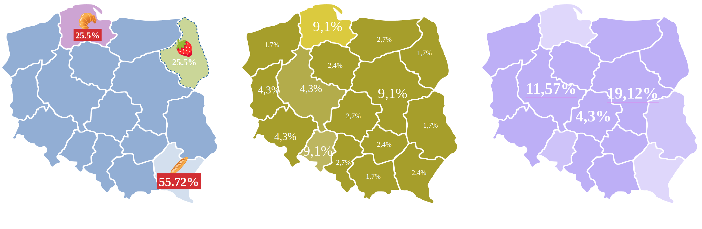
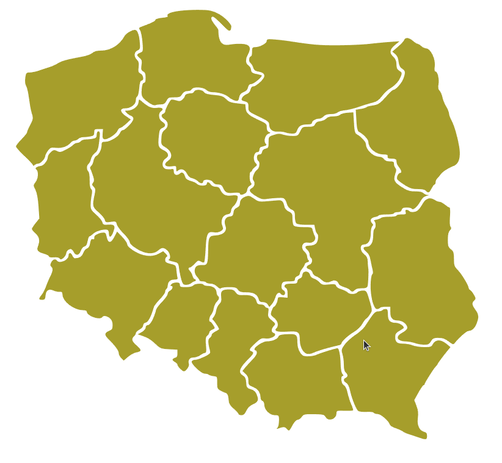
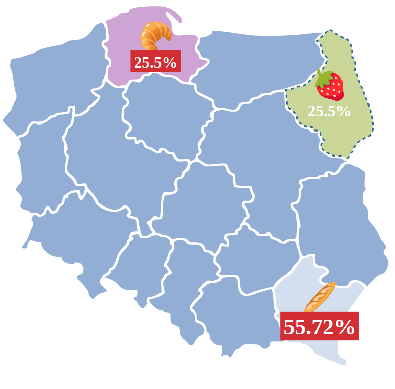

# Native web components an SVG map

This example demonstrate how to create web components using browser built in mechanism called
[custom element](https://developer.mozilla.org/en-US/docs/Web/API/Web_components/Using_custom_elements).
I used SVG map of regions of Poland to create reusable component for simple data visualisation.  
I defined `MapOfPoland` class which maps to `<map-of-poland><map-of-poland>` element, it has 
one data property `palette` which corresponds to the map background color. Component content is 
rendered using [shadow DOM](https://developer.mozilla.org/en-US/docs/Web/API/Web_components/Using_shadow_DOM).
Under the hood it uses SVG map of regions of Poland, CSS styling of each region is possible using 
[::part](https://developer.mozilla.org/en-US/docs/Web/CSS/::part) css selector. I can visualise simple text or numeric 
data dor every region, use SVG `foreignObject` tag to render data on the map and add simple CSS styling to the data.
I can listen for clicks on every region, and react to that event.  

## Overview



Check `index.html` for details.  

### How to use

To render basic map of regions you can use 

```html
<div class="maps-container">
    <map-of-poland id="accidents" data-palette="#a59f0b"></map-of-poland>
</div>
```


To make it more fancy I will use `::part` css selector and define different style for every region. Under the hood there
is an SVG element so we have to use proper css attributes (check example below).

```css 

map-of-poland#accidents::part(pomorskie) {
    fill:#dacc1d; fill-opacity: 1;
}

map-of-poland#accidents::part(opolskie) {
    fill-opacity: 0.75;
}

map-of-poland#accidents::part(wielkopolskie) {
    fill-opacity: .85;
}

map-of-poland#accidents::part(pomorskie) {
    stroke: darkolivegreen;
    stroke-dasharray: 5;
    stroke-width: 1;
    stroke-linecap: round;
    stroke-dashoffset: 100;
}


```
I can even add simple stroke animation.

```css 

map-of-poland#accidents::part(mazowieckie) {
    stroke: #cf2e2e;
    stroke-dasharray: 4;
    stroke-width: 2;
    stroke-linecap: round;
    stroke-dashoffset: 100;

    animation: dash both 5s infinite linear;
}


map-of-poland#accidents::part(pomorskie):hover {
    cursor: pointer;
    animation: dash 5s infinite linear;
}

```

https://github.com/golecgrzegorz/wc-map-of-poland/assets/52568578/41527111-32f5-4749-80ee-1f54fabd2f96


I can also change the map background color.

```js
      mapInstance.dataset.palette = '#DC84F3';
```

https://github.com/golecgrzegorz/wc-map-of-poland/assets/52568578/dc72905f-f535-4e4f-ad9d-1b6d6deee17e

#### Rendering data

To add context data for every region I can use list with `data-v` attribute to refer to specific region. We have to 
pass the list as a slot (example below). Just create simple unordered list, and inside of list item place data value you
want to assign to selected region. It uses SVG `foreignObject` tag to render html content on the map. 
Html can be styled using standard CSS attributes. I will add an inline style for additional data styling.  

```html

    <map-of-poland id="agro">
        <ul>
            <li data-v="podkarpackie">
                <span style="font-size: 2.25rem;">🥖</span> <br/> <strong style="font-size: 1.75rem; background-color: #cf2e2e; padding: 4px; color: #fff;">55.72%</strong>
            </li>
            <li data-v="pomorskie">
                <span style="font-size: 2.25rem;">🥐</span> <br/> <strong style="font-size: 1.25rem; background-color: #cf2e2e; padding: 4px; color: #fff;">25.5%</strong>
            </li>
            <li data-v="podlaskie">
                <span style="font-size: 2.25rem;">🍓</span> <br/> <strong style="font-size: 1.25rem; padding: 4px; color: #fff;">25.5%</strong>
            </li>
        </ul>
    </map-of-poland>

```



#### Create element programmatically

```js
    
    const data = {
      mazowieckie: '19,12%',
      lodzkie: '4,3%',
      wielkopolskie: '11,57%'
    }

    const agroLavMap = document.createElement('map-of-poland');
    agroLavMap.id = 'agro-lavender';
    agroLavMap.dataset.palette = '#BEADFA';

    agroLavMap.addEventListener('voivodeship-clicked', onVClicked);

    const list = document.createElement('ul');
    for (const key in data) {
      const listItem = document.createElement('li');
      listItem.innerHTML = `<span style="font-size: 2.25rem; color: #FFFFFF; font-weight: 700; border-bottom: 1px solid #DC84F3;">${data[key]}</span>`;
      listItem.dataset.v = key;

      list.append(listItem);
    }


    agroLavMap.append(list);
    document.querySelector('.maps-container').append(agroLavMap);


```
I can also listen to the region clicked event

```js
  mapInstance.addEventListener('voivodeship-clicked', (event) => {
    document.querySelector('.state-name').textContent = event.detail.name;
  })
```

This component can easily use any SVG based map. You can adjust is for your own purposes.
